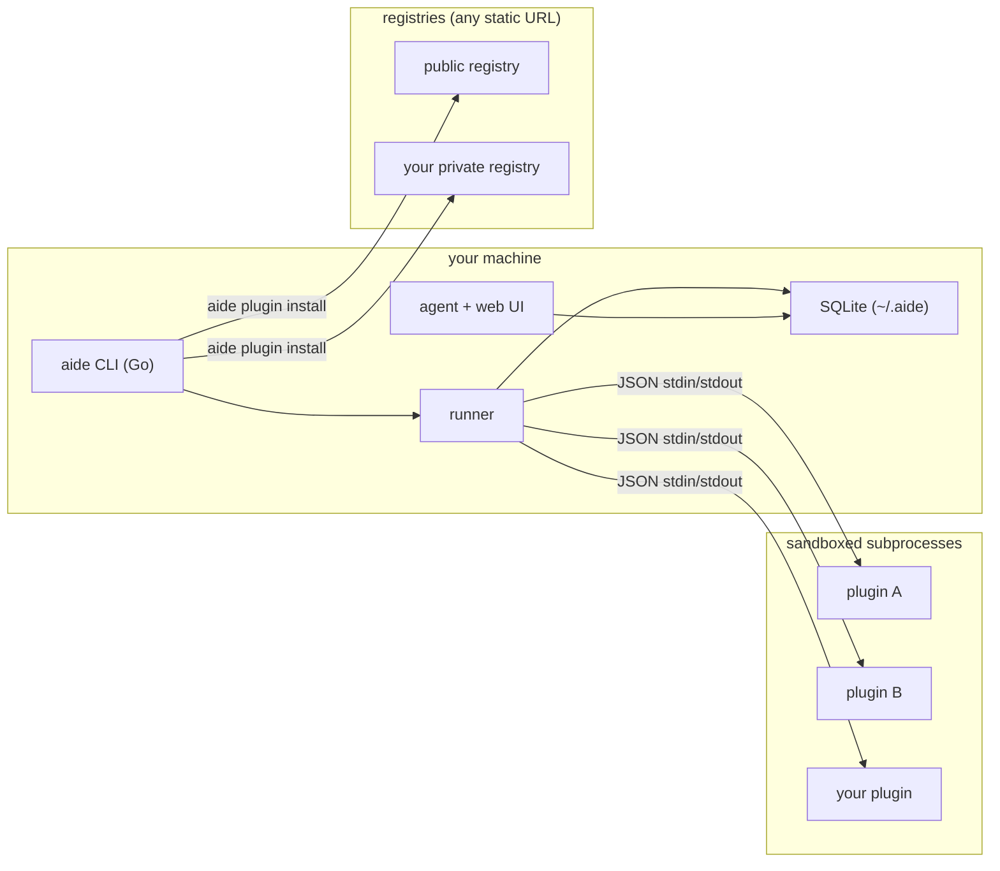

# aide

**Your work, in one place — local-first, plugin-driven, and fully yours.**

*Pronounced "aid".*

[](https://github.com/matheus-meneses/aide)
[](LICENSE)
[](https://go.dev)
[](https://python.org)

> aide is a local-first work assistant that pulls together everything competing for your attention — tickets, reviews,
> approvals, meetings, absences — into one view on your machine. It ships an autonomous agent with a web UI you can ask
> anything. Your data never leaves your laptop, and aide knows nothing about your tools until *you* teach it, one plugin
> at a time.

**What the name means.** An *aide* (pronounced "aid") is a trusted assistant — someone who quietly helps you get
things done without taking over. That is exactly the role this tool plays for your work: a helper that keeps track of
everything competing for your attention so you don't have to.

## The problem

If you lead a team or work across many systems, your day is scattered: tickets in one tool, code reviews in another,
approval queues somewhere else, meetings in your calendar, HR requests in a portal. Nothing talks to each other, and
there is no single place that answers "what actually needs me right now?" aide is that place. It runs on your machine,
collects from every source you connect, and gives you one honest answer — plus an agent you can ask follow-ups.

## Quick start

Up and running in under a minute (macOS / Linux):

```sh
curl -fsSL https://github.com/matheus-meneses/aide/releases/latest/download/install.sh | bash

aide init                      # creates ~/.aide, installs a Python runtime, fetches the registry
aide plugin install            # browse the registry and pick a source interactively
aide config source add <name>  # connect it (interactive wizard, prompts for credentials)
aide run && aide report        # collect everything, then see what needs you
```

That's the whole loop: install, connect a source, collect, read your report. Want the agent to answer follow-ups?
See [Agent mode](#agent-mode). Building from source or installing more sources? See [Getting started](#getting-started).

## Privacy & local-first

aide is built so your data stays yours.

- Everything is stored in a local SQLite database under `~/.aide` — no cloud, no account, no upload.
- The AI agent is **optional**. When you enable it, it talks to whatever endpoint you configure (`agent.llm_url`), so
  you can point it at a self-hosted model or a provider you trust.
- Browser-based plugins keep their sessions on disk under `~/.aide/plugins/<name>/`, never in someone else's database.
- aide never phones your data home. The only outbound calls are the ones your plugins make to the sources *you*
  connected.

## Security

Plugins run other people's code against your credentials, so aide treats them as untrusted by default.

**Sandboxed plugins.** Each plugin runs as an isolated subprocess wrapped by the OS sandbox — `sandbox-exec` on macOS,
`bwrap` on Linux. The policy is deny-by-default: a plugin may only write inside its own directory, and it gets **no
network access at all** unless it explicitly declares the hosts it needs in `capabilities.network`. On Linux, a plugin
with no declared network is run with its network namespace unshared — it physically cannot reach anything.

**Credential management.** Secrets live in your operating system's credential store and are managed entirely from the
CLI:

```sh
aide credential set jira       # prompts per field from the plugin's manifest, hides secrets as you type
aide credential show jira      # masked by default; pass --reveal to print values
aide credential list           # which sources have stored credentials
aide credential delete jira    # remove a field or an entire source
```

`aide credential set` reads the plugin manifest and asks only for the fields that plugin actually needs, masking
anything marked secret.

**Honest caveats.** On macOS and Windows, credentials go into the native Keychain / Credential Manager. On Linux there
is no universal secret store, so aide keeps them in a local file under your aide home — protect it like any other
dotfile. Browser-based plugins run with relaxed sandboxing because they drive a real browser engine.

## How it works

```sh
aide run                                   # collect from every enabled source, in parallel
aide report                                # ACTION REQUIRED / INFORMATIONAL split view
aide agent ask "what needs my attention today?"
```

aide orchestrates your plugins as sandboxed subprocesses and talks to them over a tiny JSON protocol on stdin/stdout. It
runs them in parallel, normalizes whatever they return into a single item model, and stores it locally in SQLite.
Plugins can be written in any language that can speak the protocol; the Python SDK makes it trivial.

## Agent mode

Agent mode is an optional local assistant that reasons over the data aide has already collected. There are two ways to
use it: a one-shot question from the terminal, or a continuous background agent with a web chat UI. Either way it only
talks to the LLM endpoint you configure — point it at a self-hosted model or any provider you trust, and nothing else
leaves your machine.

It needs data to reason about, so configure at least one source and run `aide run` first.

**1. Point it at a model.** Edit `~/.aide/config.yaml` and fill in the `agent:` block:

```yaml
agent:
  llm_url: http://localhost:11434/v1   # any OpenAI-compatible endpoint (e.g. Ollama, vLLM, a hosted provider)
  llm_model: llama3.1
  llm_api_key: ""                      # only if your endpoint requires one
  run_interval: 30m                    # how often the background agent re-collects (default 30m)
  briefing_times: ["08:00"]            # when it posts a daily briefing (default 08:00)
```

**2. Verify connectivity.** Confirm aide can reach the model before relying on it:

```sh
aide agent status        # prints the LLM URL, model, interval, and an OK / UNREACHABLE check
```

**3. Ask a one-shot question.** Great for a quick triage from the terminal:

```sh
aide agent ask "what needs my attention today?"
```

**4. Run it continuously.** Start the background agent and open the chat UI:

```sh
aide agent start         # serves on port 8531 by default; use -p to change it
```

Then open `http://localhost:8531`. The agent re-collects every `run_interval` and posts a briefing at each of your
`briefing_times`, and you can chat with it about anything in your data at any time.

## Build your own plugin

This is the point of aide: your company's internal HR portal, your team's dashboards, your on-call rota, your Slack
digest — anything with a login or an API can become a source. You write a small Python class, declare what it needs, and
it plugs right in.

```python
from datetime import date

from aide_sdk import BaseScraper, ScraperEntry


class MyScraper(BaseScraper):
  name = "my-source"
  categories = ["task"]

  def scrape(self, config, secrets):
    self.log.info("fetching from my source")
    return [
      ScraperEntry(
        member="alice",
        category="task",
        title="Something needs attention",
        entry_date=date.today(),
        priority="warning",
      )
    ]
```

```yaml
name: my-source
version: 1.0.0
runtime: python
description: "My internal source"
categories: [ task ]
entrypoint:
  python:
    script: __main__.py
requirements: requirements.txt
credentials:
  - { key: token, label: "API Token", secret: true }
capabilities:
  network: [ "api.my-company.com" ]
```

Then install it straight from a local path and wire it up:

```sh
aide plugin install --local ./my-source
aide config source add my-source
aide run
```

**Prefer Go?** Plugins can also be written in Go. The host speaks the same JSON protocol to any runtime, so a Go plugin just sets `runtime: go` and ships a compiled binary instead of a venv. Use the Go SDK in [sdk/go](sdk/go) (`plugin.Serve` + a `Handler`); see [AGENTS.md](AGENTS.md) for the contract.

The `aide dev` toolkit makes this a tight loop — and it's built for AI agents too: every subcommand is flag-driven and speaks `--json`.

```sh
aide dev new my-source            # scaffold a Python or Go plugin
aide dev validate my-source       # check the manifest and layout
aide dev test my-source           # run it locally and print the entries (no install)
aide dev package my-source        # build the release artifact + registry entry
aide dev schema                   # print the plugin.yaml JSON Schema
```

See [aide-plugins](https://github.com/matheus-meneses/aide-plugins) for builtin plugins and [AGENTS.md](AGENTS.md) for the
full authoring contract.

## Your own plugin marketplace

A registry is nothing more than a YAML index served from a URL — a GitHub Release, an internal S3 bucket, Artifactory,
even a Gist. That means a team can run its own **private plugin marketplace**: publish internal scrapers once, and
everyone installs them with a single command, no public disclosure required.

```yaml
# config.yaml
registries:
  - https://github.com/my-org/my-aide-plugins/releases/latest/download/index.yaml
```

```sh
aide plugin install my-internal-tool      # resolves from your private registry
```

Private GitHub registries authenticate with `GH_TOKEN` / `GITHUB_TOKEN` or `gh auth token`. aide merges every configured
registry, so public and private plugins live side by side.

## Architecture



Everything runs locally. Plugins are isolated processes. Registries are just URLs.

## More it can do

- **Focused report** — a terminal view split into ACTION REQUIRED and INFORMATIONAL so you triage in seconds.
- **Team awareness** — HR plugins can build an org tree so the agent understands who reports to whom.
- **Structured logging** — `aide -v run` for debug detail, `aide --log-format json run` for machine-readable logs (all
  on stderr; stdout is reserved for the plugin protocol).
- **Self-updating** — the binary checks for new releases and can update itself.

## Getting started

Install the release binary (macOS / Linux):

```sh
curl -fsSL https://github.com/matheus-meneses/aide/releases/latest/download/install.sh | bash
```

Then set yourself up:

```sh
aide init                      # creates ~/.aide, installs a Python runtime, fetches the registry
aide plugin install            # no name? browse and pick from the registry interactively
aide plugin install <name>     # or install a known plugin directly
aide config source add <name>  # interactive setup wizard
aide run && aide report        # collect and view
```

**From source** (Go 1.26+, Python 3.11+, Node 18+):

```sh
git clone https://github.com/matheus-meneses/aide.git
cd aide
make build       # binary at bin/aide
make verify      # full polyglot gate: Go + Python + frontend
```

## Contributing

Run `make verify` before opening a PR — it runs the Go, Python, and frontend gates.
See [CONTRIBUTING.md](CONTRIBUTING.md) for the full guide. New data sources belong
in [aide-plugins](https://github.com/matheus-meneses/aide-plugins) — that is the best place to start.

## License

Apache License 2.0 — see [LICENSE](LICENSE).
