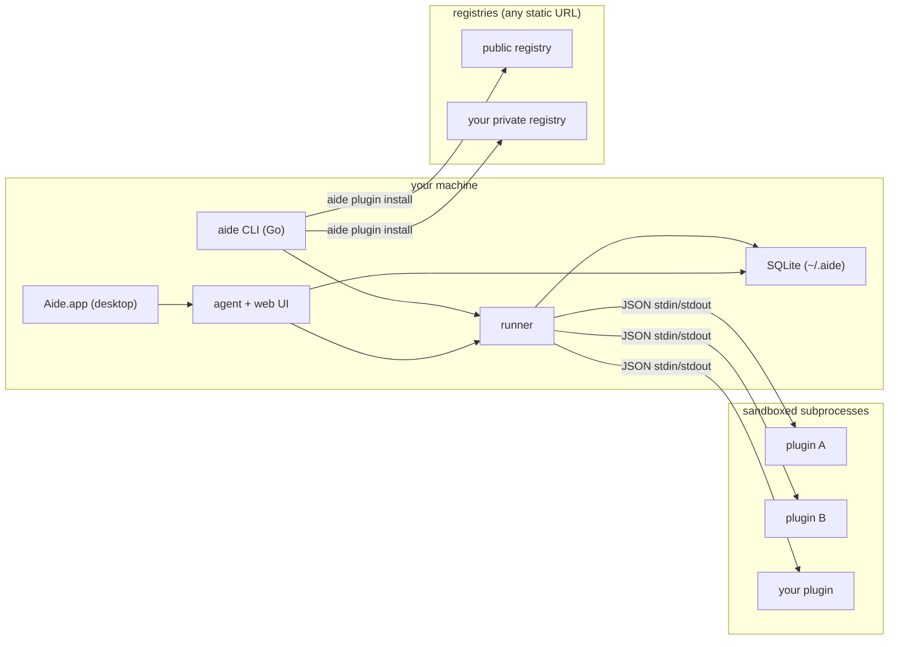

# aide

**Your work, in one place — local-first, plugin-driven, and fully yours.**

*Pronounced "aid".*

[](https://github.com/matheus-meneses/aide)
[](LICENSE)
[](https://go.dev)
[](https://python.org)

> aide is a local-first work assistant that pulls together everything competing for your attention — tickets, reviews,
> approvals, meetings, absences — into one view on your machine, and answers the question nothing else does: *what
> actually needs me right now?* It comes as a **native desktop app** with a guided setup and a built-in chat agent, and
> as a **CLI** for power users and automation — they share the same engine and the same local data. Your data never
> leaves your laptop, and aide knows nothing about your tools until *you* teach it, one plugin at a time.

**What the name means.** An *aide* (pronounced "aid") is a trusted assistant — someone who quietly helps you get
things done without taking over. That is exactly the role this tool plays for your work: a helper that keeps track of
everything competing for your attention so you don't have to.

## Install

### Brew

One tap publishes both the CLI formula and the desktop-app cask:

```sh
brew tap matheus-meneses/aide

brew install aide                 # CLI (macOS / Linux)
brew install --cask aide          # desktop app (macOS)
```

Prefer not to tap? Use the fully-qualified names:

```sh
brew install matheus-meneses/aide/aide
brew install --cask matheus-meneses/aide/aide
```

Upgrade or remove later:

```sh
brew upgrade aide                 # CLI
brew upgrade --cask aide          # desktop app
brew uninstall aide               # CLI
brew uninstall --cask aide        # desktop app
```

Homebrew always tracks the latest **stable** release — prereleases (`-rc`,
`-beta`, …) are never published to the tap, so `brew upgrade` won't pull one.
To install a specific version (including a prerelease), use the install script
with `AIDE_VERSION` (see [cURL](#curl)), or pin an older stable formula from the
tap's history:

```sh
brew install \
  "https://raw.githubusercontent.com/matheus-meneses/homebrew-aide/$(git -C "$(brew --repo matheus-meneses/aide)" log --format=%H -1 --grep='aide 0.2.0' -- Formula/aide.rb)/Formula/aide.rb"
```

### cURL

No Homebrew? The install script drops the `aide` CLI on your PATH (macOS / Linux / Windows):

```sh
curl -fsSL https://github.com/matheus-meneses/aide/releases/latest/download/install.sh | bash
```

Install a specific version (including a prerelease) by setting `AIDE_VERSION`
to a release tag:

```sh
curl -fsSL https://github.com/matheus-meneses/aide/releases/latest/download/install.sh \
  | AIDE_VERSION=v0.3.0-rc.1 bash
```

For the desktop app, grab `Aide-<version>.dmg` from the
[releases page](https://github.com/matheus-meneses/aide/releases), open it, and drag **Aide.app** to Applications:

```sh
curl -fLO https://github.com/matheus-meneses/aide/releases/download/v<version>/Aide-<version>.dmg
open Aide-<version>.dmg
```

You can also grab any prebuilt binary or the `.dmg` directly from the
[releases page](https://github.com/matheus-meneses/aide/releases).

### From source (Go 1.26+, Python 3.11+, Node 18+)

```sh
git clone https://github.com/matheus-meneses/aide.git
cd aide
make build       # CLI binary at bin/aide
make verify      # full polyglot gate: Go + Python + frontend
```

### First run

Launch the app with `open -a Aide`, run `aide ui` for the same guided experience in your browser, or drive the CLI:

```sh
aide init                       # creates ~/.aide, installs a Python runtime, fetches the registry
aide plugin install             # browse the registry and pick a source interactively
aide plugin configure <name>    # connect it (interactive wizard, prompts for credentials)
aide run && aide report         # collect everything, then see what needs you
```

That's the whole loop: install, connect a source, collect, read your report. Want the agent to answer follow-ups?
See [Agent mode](#agent-mode).

## Desktop app

The desktop app (macOS) wraps the full aide engine — agent, runner, and sandboxed plugins — in a native window, so you
get everything the CLI does without ever touching a terminal. It's the fastest way to go from install to your first
report:

- **Guided setup** — a step-by-step wizard connects your first source and points the agent at a model, no config file
  required.
- **Chat agent** — ask about your work in plain language and get answers, with daily briefings posted on your schedule.
- **Live logs** — watch every source and plugin run in real time, spot failures at a glance, and prune old logs in a
  click.

The app and the CLI share the same `~/.aide`, so anything you set up in one shows up in the other — set up sources in
the app, then script them from the CLI, or vice versa.

## Privacy & local-first

aide is built so your data stays yours.

- Everything is stored in a local SQLite database under `~/.aide` — no cloud, no account, no upload.
- The AI agent is **optional**. When you enable it, it talks to whatever endpoint you configure (`agent.llm_url`), so
  you can point it at a self-hosted model or a provider you trust.
- Browser-based plugins keep their sessions on disk under `~/.aide/plugins/<name>/`, never in someone else's database.
- aide never phones your data home. The only outbound calls are the ones your plugins make to the sources *you*
  connected.

## Security

Plugins run other people's code against your credentials, so aide treats them as untrusted by default.

**Sandboxed plugins.** Each plugin runs as an isolated subprocess wrapped by the OS sandbox — `sandbox-exec` on macOS,
`bwrap` on Linux. The policy is deny-by-default: a plugin may only write inside its own directory, and it gets **no
network access at all** unless it explicitly declares the hosts it needs in `capabilities.network`. On Linux, a plugin
with no declared network is run with its network namespace unshared — it physically cannot reach anything.

**Credential management.** Secrets live in your operating system's credential store and are managed entirely from the
CLI:

```sh
aide credential set jira       # prompts per field from the plugin's manifest, hides secrets as you type
aide credential show jira      # masked by default; pass --reveal to print values
aide credential list           # which sources have stored credentials
aide credential delete jira    # remove a field or an entire source
```

`aide credential set` reads the plugin manifest and asks only for the fields that plugin actually needs, masking
anything marked secret.

**Honest caveats.** On macOS and Windows, credentials go into the native Keychain / Credential Manager. On Linux there
is no universal secret store, so aide keeps them in a local file under your aide home — protect it like any other
dotfile. Browser-based plugins run with relaxed sandboxing because they drive a real browser engine.

## How it works

```sh
aide run                                   # collect from every enabled source, in parallel
aide report                                # ACTION REQUIRED / INFORMATIONAL split view
aide agent ask "what needs my attention today?"
```

aide orchestrates your plugins as sandboxed subprocesses and talks to them over a tiny JSON protocol on stdin/stdout. It
runs them in parallel, normalizes whatever they return into a single item model, and stores it locally in SQLite.
Plugins can be written in any language that can speak the protocol; the Python SDK makes it trivial.

## Agent mode

Agent mode is an optional local assistant that reasons over the data aide has already collected. There are two ways to
use it: a one-shot question from the terminal, or a continuous background agent with a web chat UI. Either way it only
talks to the LLM endpoint you configure — point it at a self-hosted model or any provider you trust, and nothing else
leaves your machine.

**Providers.** Pick one with `llm_provider` (the wizard asks for you):

- `openai` *(default)* — any OpenAI-compatible Chat Completions endpoint (`POST /chat/completions`): OpenAI,
  Azure OpenAI, and local runtimes like [Ollama](https://ollama.com),
  [vLLM](https://github.com/vllm-project/vllm), or [LM Studio](https://lmstudio.ai). Set `llm_url` to the API base
  (e.g. `http://localhost:11434/v1`).
- `litellm` — a [LiteLLM](https://github.com/BerriAI/litellm) proxy, which presents 100+ providers (OpenAI, Anthropic
  Claude, Google Gemini, AWS Bedrock, Azure OpenAI, Groq, and more) behind one OpenAI-compatible URL. Point `llm_url`
  at the proxy.
- `anthropic` — Anthropic's native Messages API directly (no proxy). Uses `https://api.anthropic.com` by default.

More providers can be added behind the same interface over time.

It needs data to reason about, so configure at least one source and run `aide run` first.

**1. Point it at a model.** Run the guided setup — it asks for your endpoint, model, and schedule:

```sh
aide agent config
```

If your endpoint needs an API key, the wizard offers to store it as a scoped secret in your OS keychain (the same way plugin credentials are handled — never in plaintext config). You can also set or rotate it later with:

```sh
aide credential set agent
```

Prefer editing YAML? The non-secret settings live under the `agent:` block of `~/.aide/config.yaml`:

```yaml
agent:
  llm_provider: openai                 # openai (default) | litellm | anthropic
  llm_url: http://localhost:11434/v1   # API base for openai/litellm; omit for anthropic's default
  llm_model: llama3.1
  run_interval: 30m                    # how often the background agent re-collects (default 30m)
  briefing_times: ["08:00"]            # when it posts a daily briefing (default 08:00)
```

**2. Verify connectivity.** Confirm aide can reach the model before relying on it:

```sh
aide agent status        # prints the LLM URL, model, interval, and an OK / UNREACHABLE check
```

**3. Ask a one-shot question.** Great for a quick triage from the terminal:

```sh
aide agent ask "what needs my attention today?"
```

**4. Run it continuously.** Launch the web UI with the autonomous agent running behind it:

```sh
aide ui                  # serves on port 8531 by default and opens your browser; use -p to change it
```

It opens `http://localhost:8531` automatically (pass `--no-browser` to skip). The agent re-collects every
`run_interval` and posts a briefing at each of your `briefing_times`, and you can chat with it about anything in your
data at any time.

Prefer a headless daemon with no web server? Run the loop in the foreground and background it yourself:

```sh
aide agent start         # runs the autonomous loop until Ctrl-C; no HTTP server, no UI
```

## Build your own plugin

This is the point of aide: your company's internal HR portal, your team's dashboards, your on-call rota, your Slack
digest — anything with a login or an API can become a source. You write a small Python class, declare what it needs, and
it plugs right in.

```python
from datetime import date

from aide_sdk import BaseScraper, ScraperEntry


class MyScraper(BaseScraper):
  name = "my-source"
  categories = ["task"]

  def scrape(self, config, secrets):
    self.log.info("fetching from my source")
    return [
      ScraperEntry(
        member="alice",
        category="task",
        title="Something needs attention",
        entry_date=date.today(),
        priority="warning",
      )
    ]
```

```yaml
name: my-source
version: 1.0.0
runtime: python
description: "My internal source"
categories: [ task ]
entrypoint:
  python:
    script: __main__.py
requirements: requirements.txt
credentials:
  - { key: token, label: "API Token", secret: true }
capabilities:
  network: [ "api.my-company.com" ]
```

Then install it straight from a local path and wire it up:

```sh
aide plugin install --local ./my-source
aide plugin configure my-source
aide run
```

**Prefer Go?** Plugins can also be written in Go. The host speaks the same JSON protocol to any runtime, so a Go plugin just sets `runtime: go` and ships a compiled binary instead of a venv. Use the Go SDK in [sdk/go](sdk/go) (`plugin.Serve` + a `Handler`); see [AGENTS.md](AGENTS.md) for the contract.

The `aide dev` toolkit makes this a tight loop — and it's built for AI agents too: every subcommand is flag-driven and speaks `--json`.

```sh
aide dev new my-source            # scaffold a Python or Go plugin
aide dev validate my-source       # check the manifest and layout
aide dev test my-source           # run it locally and print the entries (no install)
aide dev package my-source        # build the release artifact + registry entry
aide dev schema                   # print the plugin.yaml JSON Schema
```

See [aide-plugins](https://github.com/matheus-meneses/aide-plugins) for builtin plugins and [AGENTS.md](AGENTS.md) for the
full authoring contract.

## Your own plugin marketplace

A registry is nothing more than a YAML index served from a URL — a GitHub Release, an internal S3 bucket, Artifactory,
even a Gist. That means a team can run its own **private plugin marketplace**: publish internal scrapers once, and
everyone installs them with a single command, no public disclosure required.

```yaml
# config.yaml
registries:
  - https://github.com/my-org/my-aide-plugins/releases/latest/download/index.yaml
```

```sh
aide plugin install my-internal-tool      # resolves from your private registry
```

Private GitHub registries authenticate with `GH_TOKEN` / `GITHUB_TOKEN` or `gh auth token`. aide merges every configured
registry, so public and private plugins live side by side.

## Architecture



Everything runs locally. Plugins are isolated processes. Registries are just URLs.

## More it can do

- **Focused report** — a terminal view split into ACTION REQUIRED and INFORMATIONAL so you triage in seconds.
- **Team awareness** — HR plugins can build an org tree so the agent understands who reports to whom.
- **Structured logging** — `aide -v run` for debug detail, `aide --log-format json run` for machine-readable logs (all
  on stderr; stdout is reserved for the plugin protocol).
- **Self-updating** — the binary checks for new releases and can update itself.

## Contributing

Run `make verify` before opening a PR — it runs the Go, Python, and frontend gates.
See [CONTRIBUTING.md](CONTRIBUTING.md) for the full guide. New data sources belong
in [aide-plugins](https://github.com/matheus-meneses/aide-plugins) — that is the best place to start.

## License

[Business Source License 1.1](LICENSE). Free for internal, personal, educational,
evaluation, and non-commercial use. Offering aide as a paid product or hosted
service requires a commercial license — see [COMMERCIAL.md](COMMERCIAL.md). Each
released version converts to the Apache License 2.0 four years after its release.
